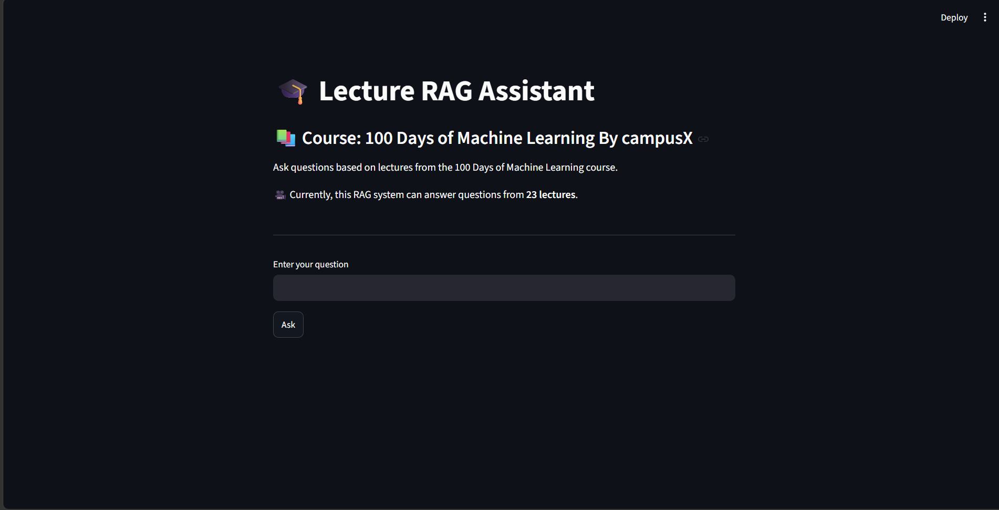
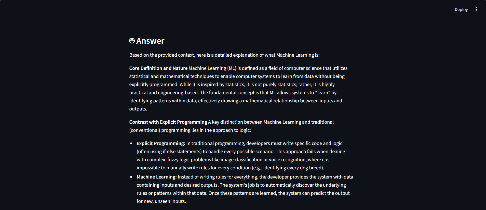
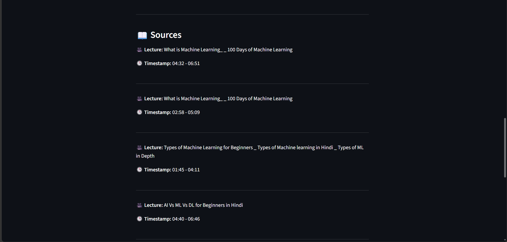

# Lecture RAG Assistant

Ask questions about a video course and get answers grounded in the lecture transcripts.

Built by [Harsh Bhandari](https://github.com/harshbhandari-data).

This project is a beginner-friendly **Retrieval-Augmented Generation (RAG)** application built with Python, Streamlit, FAISS, BGE-M3, and Ollama. Instead of asking an AI model to answer from memory, it first searches the course material and then gives the most relevant text to the language model.

## What It Does


The current dataset is based on the **100 Days of Machine Learning** course by campusX.

## How It Works

```text
Your question
	|
	v
BGE-M3 creates a question embedding
	|
	v
FAISS finds the most relevant transcript chunks
	|
	v
Ollama receives the chunks and writes a grounded answer
	|
	v
Answer + lecture timestamps
```

## Demo

Run the app and open the local URL shown in your terminal, usually `http://localhost:8501`.

## 📸 Screenshots

### 🖥️ How the UI Looks

This is the main screen where you enter a question about the lectures.



### 🤖 How the Answer Is Displayed

The application displays a detailed answer based on the relevant lecture content.



### 📚 How Sources Are Shown

The sources section shows the lecture names and timestamps used to generate the answer.



## Requirements


The complete dependency list is available in [requirements.txt](requirements.txt).

## Installation

### 1. Clone the project

```bash
git clone https://github.com/harshbhandari-data/Rag-Video-QA.git
cd Rag-Video-QA
```

### 2. Create a virtual environment

On Windows PowerShell:

```powershell
python -m venv venv
.\venv\Scripts\Activate.ps1
```

On macOS or Linux:

```bash
python3 -m venv venv
source venv/bin/activate
```

### 3. Install Python dependencies

```bash
python -m pip install --upgrade pip
pip install -r requirements.txt
```

> The exact PyTorch line in `requirements.txt` is configured for CUDA 12.1. If you do not have an NVIDIA GPU, install the CPU version of PyTorch from the [official PyTorch selector](https://pytorch.org/get-started/locally/), then install the remaining requirements.

### 4. Install and prepare Ollama

Install Ollama from [ollama.com](https://ollama.com), make sure it is running, and download the model:

```bash
ollama pull qwen3.5:9b
```

Check that the model is available:

```bash
ollama list
```

The first answer can take longer because the model must be loaded into memory.

## Run the App

From the project root:

```powershell
cd src
streamlit run app.py
```

Then open the URL printed by Streamlit. Enter a question such as:

```text
What is the difference between batch and online machine learning?
```

## Project Structure

```text
Rag-video-QA/
|-- data/
|   |-- transcripts/          Original transcripts
|   |-- cleaned_transcripts/  Cleaned transcript data
|   |-- chunks/               Searchable transcript chunks
|   |-- embeddings/           Embeddings and metadata
|   `-- vector_store/         FAISS index
|-- src/
|   |-- app.py                Streamlit user interface
|   |-- rag.py                Command-line RAG question answering
|   |-- audioToText.py        Audio transcription
|   |-- clean_transcripts.py  Transcript cleanup
|   |-- chunks_transcript.py  Creates overlapping chunks
|   |-- create_embedding.py   Creates BGE-M3 embeddings
|   |-- create_faiss.py       Builds the FAISS vector index
|   `-- retrieve.py           Tests transcript retrieval
|-- requirements.txt          Installable Python dependencies
`-- README.md                 Project documentation
```

## Rebuild the Knowledge Base

The repository already contains generated data in `data/`. If you add new videos or transcripts, the general processing order is:

1. Convert video or audio to transcripts with `audioToText.py`.
2. Clean the transcripts with `clean_transcripts.py`.
3. Create chunks with `chunks_transcript.py`.
4. Create embeddings with `create_embedding.py`.
5. Build or update the FAISS index with `create_faiss.py`.

Run these scripts from the project root so their relative paths resolve correctly.

## Troubleshooting

### Ollama is slow

The `qwen3.5:9b` model needs a significant amount of memory. Close other GPU-heavy applications, confirm Ollama is running, or use a smaller Ollama model and update the model name in `src/app.py`.

### `FileNotFoundError` for FAISS or metadata files

Run Streamlit from the `src` directory as shown above, and confirm these files exist:

```text
data/vector_store/faiss.index
data/embeddings/metadata.parquet
```

### Answers are not relevant

The answer can only be as good as the indexed transcripts. Check the retrieved chunks with `retrieve.py`, then rebuild the embeddings and FAISS index after changing the source data.

## Learning Goals

This project is useful for learning:

- Python project structure
- Speech-to-text transcription
- Text cleaning and chunking
- Embeddings and semantic search
- Vector search with FAISS
- RAG application design
- Local language models with Ollama
- Streamlit application development

## Future Improvements

- Add clickable video links that open at the cited timestamp.
- Add chat history for follow-up questions.
- Add a model selector for faster or more detailed answers.
- Add automated tests for retrieval quality and answer accuracy.
- Add a simple upload workflow for new lectures.

## 👤 Author

Created by [Harsh Bhandari](https://github.com/harshbhandari-data).

